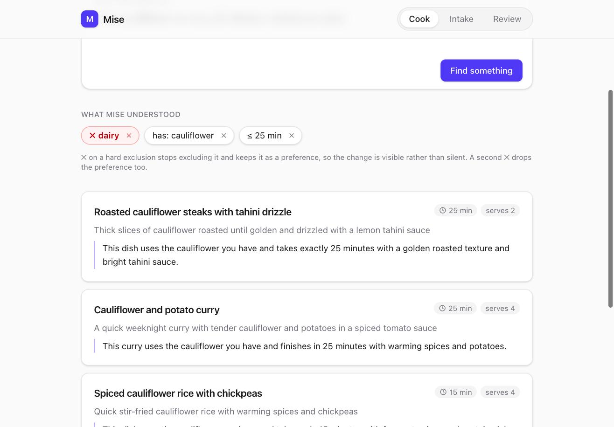
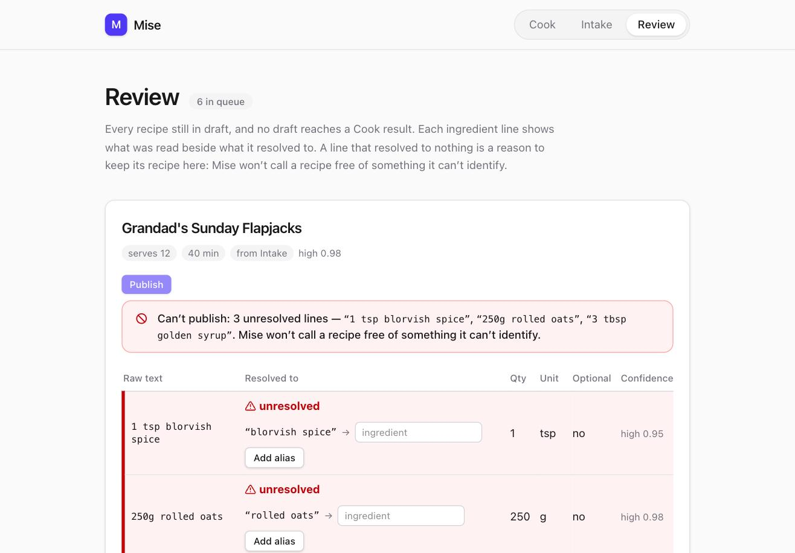

# Mise

> **TL;DR**
>
> - **What it is.** An AI recipe assistant that answers *what can I actually cook right
>   now* for a household where someone has a hard dietary exclusion. It has three screens:
>   **Cook** (free text in, ranked shortlist out), **Intake** (a pasted recipe or a
>   photographed card becomes a draft) and **Review** (a person publishes drafts).
> - **The core idea.** Exclusions are never left to the model. Three gates enforce them:
>   an exclusion that doesn't resolve becomes a question, SQL applies a `NOT EXISTS` over
>   the canonical ingredient tree, and generated prose is scanned for excluded ingredients
>   before it renders. The model reads intent and writes prose. It never decides which
>   recipes exist.
> - **Technologies.** Next.js 16 (App Router), TypeScript strict, Zod at every boundary,
>   Postgres with Drizzle, the Anthropic SDK called directly (`claude-haiku-4-5` for
>   constraint extraction, `claude-sonnet-4-5` for recipe extraction, vision and ranking),
>   and Tailwind.
> - **Tests.** Vitest unit tests with no network and no database (`pnpm test`, run by CI
>   on every PR). Separate SQL tests for gate 2 run against Postgres (`pnpm test:db`). An
>   eval suite runs the real model (`pnpm eval`: 17 constraint fixtures and 6 recipe
>   sources, 3 runs each). Exclusion accuracy and null-precision thresholds are pegged
>   at 100%. The last run is committed in [`evals/latest.md`](evals/latest.md).
> - **Deployed.** Vercel, with Postgres on Neon, live at
>   **<https://mise-liard-eight.vercel.app>**. A push to `main` deploys production.
>   GitHub Actions runs typecheck, lint and test, and never calls a model.
> - **Agentic workflow.** Claude Code agents did most of the building, through a loop
>   run as skills against GitHub issues:
>   `/spec → /plan → human /approve → /build → /verify → /ship → human merge`. The spec
>   is written before any code, a test fails before the change that passes it, and an
>   independent `invariant-reviewer` agent checks each branch. Git hooks and Claude Code
>   hooks keep the human in charge of approvals, thresholds and dependencies. I added it
>   to move faster, and the guardrails are what make that speed trustworthy. See
>   [Working on this repo](#working-on-this-repo) and
>   [`docs/workflow.md`](docs/workflow.md).

## Reading this against the brief

| The brief asks for | Where it is |
|---|---|
| Live demo | <https://mise-liard-eight.vercel.app>. [`docs/demo.md`](docs/demo.md) walks through every outcome with the expected result of each step |
| Project overview: problem, users, scope | [Overview](#overview), [Two surfaces](#two-surfaces), and [Status](#status) |
| Tech stack | [Tech stack](#tech-stack) |
| How AI is used, and *why this model* | [How AI is used](#how-ai-is-used) and [ADR 0004](docs/decisions/0004-model-provider.md) |
| Setup instructions | [Running it](#running-it) for local, [Deploying](#deploying) for Vercel and Neon |
| Trade-offs, and improvements with more time | [Trade-offs](#trade-offs) and [With more time](#with-more-time) |
| Frontend: clean UI, UX considerations | [Two surfaces](#two-surfaces), with screenshots |
| Backend: API layer, separation of concerns | [Architecture](#architecture) and [`app/api/README.md`](app/api/README.md) |
| Optional: database, tests, deployment | All three: Postgres with Drizzle, [How it's tested](#how-its-tested), and [Deploying](#deploying) |
| Optional: authentication | Deliberately not built. There's one household, and auth isn't what the project is testing. The cost is in [With more time](#with-more-time) |
| Problem-solving approach, explaining decisions | [The three gates](#the-three-gates), [Trade-offs](#trade-offs), and the ADRs in [`docs/decisions/`](docs/decisions) |
| Code quality and structure | [Architecture](#architecture). The working rules the code is held to are in [`CLAUDE.md`](CLAUDE.md) |

## Overview

**An exclusion is never a model decision. It is a database constraint, and generated
text is validated against it before it renders.**

Mise answers one question — *what can I actually cook right now* — against a recipe
catalogue it also knows how to build. It is aimed at a home cook feeding a household
where one person has a hard dietary exclusion. That detail is the whole product: a soft
preference tolerates a wrong answer, an allergen does not, and every architectural
decision here follows from treating exclusion as a safety property rather than a
ranking signal.

*Mise en place* is the kitchen discipline of prepping every ingredient before any
cooking starts. It names the architecture rather than the app. The canonical ingredient
tree, the alias table, the allergen hierarchy — all of it is prep work done before a
single query arrives. At request time the system looks things up and explains them. It
does not ask a model to be careful at the moment carefulness is hardest to verify.

### Status

> **Cook and Intake work end to end.** `POST /api/cook` plus the Cook screen
> run the full path — constraints out of free text, gate 2's filter, ranked prose
> behind gate 3. `POST /api/intake` plus the Intake screen turn a pasted recipe *or a
> photographed card* into a draft in the queue, each ingredient line resolved or
> explicitly not. The Review screen lists that queue: every draft, each line's raw text
> beside what it resolved to, and a publish button that stays disabled, with the
> blocking lines named, while any line is unresolved, or while the draft has no lines at
> all. `POST /api/review/:id/publish` enforces the same rule in SQL, so calling it
> directly doesn't get around it. An unresolved line can be fixed in place: name what
> its term means, and `POST /api/aliases` re-resolves every draft line held by that
> term — the draft unblocks, and a person still presses publish. Progress is tracked in
> [Issues](https://github.com/stuart-ohare/mise/issues).

## Two surfaces

**Cook.** Free text in — *"half a cauliflower, no dairy, 25 minutes, and I can't face
another curry"* — and a ranked shortlist out, each recipe with a one-line rationale.
What the system understood renders as chips above the results, so a misread can be
corrected without retyping the sentence. Hard exclusions look different from soft
preferences, because the interface should tell the same story as the architecture.



`POST /api/cook` is where the three gates meet. It answers with one of five outcomes
rather than results-or-error: a ranked shortlist, cards without prose (gate 3 rejected
the sentences twice, or ranking was unavailable), a question when an exclusion resolved
to nothing, nothing-found — with the time limit offered back when relaxing it would
help — or a report that the request itself couldn't be read. The screen renders each
one distinctly, and the union makes a sixth outcome a compile error rather than a blank
panel. Substitutions are not among them: no row in the catalogue supports one yet.

**✕ on a hard exclusion demotes it; it doesn't delete it.** `✗ dairy` becomes the soft
`not: dairy`, and a second ✕ removes that. Be precise about what each click does: the
first one is what stops the filtering, because gate 2 reads `exclude` alone — the second
only drops the ranking weight. So it takes two clicks to clear a food off the row and
one to stop excluding it. What the demotion buys is not an extra confirmation step but
visibility: the chip changes under your hand from `✗ dairy` to `not: dairy`, the ✕ says
"stop excluding dairy — makes it a preference instead" before you press it, and the food
stays on screen instead of vanishing. A mistake is legible and reversible rather than
silent. An exclusion gate 1 couldn't resolve can't
be demoted at all: gate 2 filters on a canonical id, so a term that mapped to nothing
has nothing behind it, and moving it to a list that only weights ranking would leave a
shortlist that was never filtered on the food the cook named. That rule lives in
[`lib/domain/constraint-edits.ts`](lib/domain/constraint-edits.ts) as a pure function
with tests, not in the component that draws the button.

**Intake.** Paste a recipe blog's wall of text, or photograph a handwritten card. Out
comes a structured draft with per-field confidence, landing in a review queue — never
straight into the database. The screen shows each ingredient line as the model read it
beside what it resolved to, so the extraction is legible rather than assumed.

The model reading the paste is never shown the ingredient catalogue and never picks a
canonical id. It returns the food in the recipe's own words, and gate 1 resolves that
against the same index a Cook exclusion goes through. A line that maps to nothing is
stored as `canonical_id = null` with its raw text intact, and that null is what blocks
the recipe from leaving draft: paste a recipe using ghee into a catalogue that has never
heard of it, and the draft says so rather than filing it under butter. The reviewer
then says *ghee is clarified butter*, every draft line named `ghee` resolves through
the tree, and once published the recipe leaves a dairy-free search because ghee rolls up
to dairy — not because anyone tagged it.

A photograph takes the identical path. The card is sent as an image block on the same
call, with the same prompt and the same schema, and its lines go through the same
resolution index — so a ghee line photographed off a card is exactly as unresolved as
one pasted from a blog. The image arrives as a data URI and is stored whole in
`extraction_job.raw_input`, capped at 6 MiB and rejected at the schema boundary above
that: object storage is a dependency this project does not carry, and a bucket key would
leave a reviewer looking at a dead link where the card should be.

**What the extraction will not do is guess.** If the text doesn't state a quantity, the
line has none — not a typical amount. If it never says how many it feeds, `serves` is
null, however obvious four looks. A reviewer fills in a blank; they skim past a plausible
number and approve it.



The screens have loading and pending states for every model wait, and a dark theme. All
eleven screenshots are in [`docs/screenshots/95/`](docs/screenshots/95).

## The three gates

| Gate | Where | What it does |
|---|---|---|
| 1 — Resolution | Constraint extraction | An exclusion that can't be mapped to a canonical ingredient is asked about, never silently dropped. A freshly seeded catalogue deliberately doesn't know `ghee`, so *no ghee* is a question, not a filter — until a reviewer adds the alias |
| 2 — Query | SQL | The exclusion becomes a `NOT EXISTS` over `recipe_ingredient` joined through the canonical tree. *Garlic butter mushrooms on toast* vanishes from a dairy-free search because butter's parent is dairy — not because anyone tagged the recipe |
| 3 — Output | Pre-render | Generated prose is scanned for aliases of anything excluded. A hit is rejected, logged and retried once; a second failure returns cards without prose rather than unverified text |

Gate 2 already guarantees the rows. Gate 3 exists because the model writes sentences,
and sentences invent — *"finish with a knob of butter"* attached to a recipe that
contains none. The filter guarantees the rows; nothing guarantees the sentences except
checking them.

## Architecture

One Next.js app, with each layer in its own place. Every arrow into or out of a model
call, and across the HTTP boundary, passes through a Zod schema.

```
Browser
  app/page.tsx, intake/, review/     Server Components; "use client" only for interaction
  app/_components/*-client.tsx       forms, chips and fetch calls; renders each response kind
        │  fetch, JSON parsed by the same schema.ts the route uses
        ▼
  app/api/<route>/route.ts           HTTP shell: parse the request, run, parse the response
  app/api/<route>/schema.ts          request and response unions, shared with the screen
  app/api/<route>/run.ts             the pipeline, with the DB and model passed in as deps
        │
        ├── lib/ai/prompts/*         one file per model call: prompt, Zod schema, VERSION
        ├── lib/domain/*             pure functions: resolution, the tree, the output gate
        └── lib/db/*                 Drizzle queries; gate 2's NOT EXISTS is in candidates.ts
```

- **The pipeline has no framework or I/O in it.** `run.ts` receives its queries and
  model calls as arguments, so the whole gate sequence is unit-tested without a database
  or an API key.
- **Domain rules are pure functions.** For example, "an unresolved exclusion can't be
  demoted" lives in `lib/domain/constraint-edits.ts`, not in the button that enforces it.
- **There's no service or repository layer, on purpose.** Route handlers call the query
  modules directly. That boundary gets added when a second consumer appears. The Review
  page, a Server Component, reads its queue the same way.
- **The response is a discriminated union, not results-or-error.** The screen switches
  on `kind`, so a new outcome is a compile error rather than a blank panel.

## Tech stack

| Layer | Choice | Why |
|---|---|---|
| Framework | Next.js App Router, single app | One deploy, one type boundary. A separate API server is right at scale and wrong at this scope |
| Language | TypeScript, strict, no `any` | |
| Validation | Zod, shared client and server | The same schema validates model output and the HTTP boundary. This is the load-bearing choice |
| Database | Postgres (Docker Compose), Drizzle | Real SQL, real constraints, real migrations |
| Model client | Anthropic SDK, direct | No LangChain, no wrapper — see [ADR 0004](docs/decisions/0004-model-provider.md) |
| UI | Tailwind, hand-rolled components | Three screens don't earn a component library |
| Tests | Vitest for units, plus an eval suite | Aiming at the invariants, not at coverage |

## How AI is used

Three model calls, each with a narrow job and a Zod schema on its output. All prompts
live in [`lib/ai/prompts/`](lib/ai/prompts) with their schema and a version constant.

1. **Constraint extraction** — free text to typed constraints. The `exclude` / `avoid`
   split is the most important line in the codebase: one is a `WHERE` clause, the other
   is a ranking weight.
2. **Recipe extraction** — a pasted wall of text to a draft with per-field confidence,
   one score for `title`, `serves` and `minutes` and one on every ingredient line. Its
   central instruction is that an unstated value returns `null`; a plausible invented
   quantity is worse than a missing one, because a reviewer skims past it. It scores its
   own reading, not the value — a null it is certain about is a high score. The same
   call takes a photograph of a recipe card as an image block, on the vision-capable
   model, with one prompt covering both.
3. **Ranking and explanation** — takes the already-filtered candidate rows and returns
   an ordered list of IDs with a rationale each, constrained to the IDs it was given.

The model parses intent and writes prose. It never decides what exists.

### Why Claude, and why two sizes

The reasons are about the jobs the model does. The full argument, and the alternative
that lost, is in [ADR 0004](docs/decisions/0004-model-provider.md).

- **Output that fits a schema.** A Zod schema parses every call at the boundary, so a
  model that drifts from the schema costs a retry on every request.
- **Two sizes on one API.** Constraint extraction is short, frequent and cheap to get
  wrong, so it runs on Haiku. Recipe extraction is long, messy and expensive to get wrong,
  so it runs on Sonnet, and ranking uses the same tier. One model for both jobs would be
  either slow or sloppy.
- **Vision on the same API.** The handwritten-card path needed no second integration.
- **Called directly, with no wrapper.** The SDK is imported in one file. Anything that
  hides provider differences would also hide the structured-output and vision features
  the schemas depend on.

The choice was made by reasoning, not measurement: no other provider has been run on the
fixtures yet. The architecture limits the damage a weaker model could do. SQL decides
which rows an exclusion removes, and gate 3 checks the prose. A worse ranker shows up as
more retries and more cards without prose, not as an allergen on screen. The exception is
constraint extraction: an exclusion the model misses is one that no gate enforces. That
is why exclusion accuracy is held at 100% in the evals.

### AI in the build: an agentic SDLC

AI is also how this repository was built. Claude Code agents did most of the typing,
inside a delivery process where each step is a Claude Code skill run against a GitHub
issue, and a human holds the approvals.

I added this workflow deliberately, to move faster. With a tight time box, agents could
do the typing in parallel worktrees while I spent my time on the decisions: approving
specs and plans, ruling on review concerns, merging. The steps around them are what kept
that speed from costing correctness in an app where a wrong answer is an allergen: the
spec first, a failing test first, and an independent reviewer.

| Stage | Agent does | Human does |
|---|---|---|
| `/spec` | Asks questions one at a time, then drafts the issue with observable acceptance criteria and gate labels | Approves the draft |
| `/plan` | Posts an implementation plan as an issue comment, then stops | Approves it with `/approve`, a skill only the user can run |
| `/build` | Works in its own git worktree. Writes a failing test or eval fixture first, then the smallest change that passes | |
| `/verify` | Runs `verify.sh` (typecheck, lint, test, a gate-fixture rule, eval-report freshness). Then a separate `invariant-reviewer` agent, with fresh context, reviews the diff against the invariant | Decides on anything the reviewer raises as a concern |
| `/ship` | Opens the PR, ticking each acceptance criterion against named evidence | Merges |

Guardrails keep that split honest. Git hooks reject commits and pushes on `main`, and
commit messages without an issue number. Claude Code hooks stop an agent from skipping
those hooks, editing eval thresholds, changing dependencies or approving its own plan. CI
never calls a model.

The issue and PR history is the evidence: 57 issues and 41 merged PRs.
[`docs/workflow.md`](docs/workflow.md) traces three changes through the process, with
what it caught. One example: the reviewer found that the unauthenticated alias route could
rebind any term, so *no groundnuts* could quietly turn into a filter on the wrong food.
That was fixed before merge, with the failing test committed first. The mechanics are in
[Working on this repo](#working-on-this-repo), and the reasoning is in
[ADR 0003](docs/decisions/0003-issue-driven-agentic-workflow.md).

## Running it

Needs Node, pnpm, Docker, and [`jq`](https://jqlang.org) for the workflow guards.
[`docs/demo.md`](docs/demo.md) walks from here to every outcome, with the expected result of each step.

```bash
pnpm install                   # also installs the git hooks (skipped by --ignore-scripts)
cp .env.example .env.local     # add your ANTHROPIC_API_KEY
docker compose up -d           # Postgres on :5432 (POSTGRES_PORT to change it)
pnpm db:push                   # apply the Drizzle schema
pnpm seed                      # load the allergen tree and 60 recipes (3 left in draft)
pnpm dev
```

| Command | What it does |
|---|---|
| `pnpm typecheck` | `next typegen` then `tsc --noEmit` |
| `pnpm test` | Vitest units — no network, no API calls, no database |
| `pnpm test:db` | Gate 2's SQL and the seed's term-collision and tree-change checks against Postgres (`*.db.test.ts`). Needs `docker compose up -d`, `pnpm db:push` and `DATABASE_URL` in `.env.local`. Every write rolls back, and it doesn't need the seed. Not run in CI |
| `pnpm eval` | Eval suite against the real model. **Costs money** — one run is 69 calls — and is non-deterministic. Runs constraint extraction (17 fixtures) and recipe extraction (6 sources), 3 runs each ([evals/README.md](evals/README.md)) |

## How it's tested

Testing is aimed at the invariant rather than at coverage. There are three layers, and
only the first runs in CI.

| Layer | Command | What it proves |
|---|---|---|
| Unit | `pnpm test` (CI, every PR) | Pure domain logic: resolution, the ingredient tree, gate 3's scan, chip edits. Each route's pipeline, with the model and database stubbed, covering all five Cook outcomes and every fail-closed path. Schemas and the seed catalogue. The workflow guards themselves: `verify.sh`, the hooks and the skills |
| Database | `pnpm test:db` (local) | Gate 2's real SQL. A recipe with butter disappears from a dairy-free search because butter's parent is dairy. It also covers the publish gate, alias re-resolution and the seed's collision checks. Every write rolls back |
| Eval | `pnpm eval` (local, paid) | The real model on 23 fixtures, 3 runs each. `exclude_exact` and `null_precision` must be 100%. The last run is committed as [`evals/latest.md`](evals/latest.md), with the prompt version and commit that produced it |

A test that covers a gate says so: `// @gate query` in a Vitest file, or
`"gates": ["query"]` in an eval fixture. `/verify` won't pass a gate-labelled issue unless
a test declaring that gate was added or changed.

## Deploying

Vercel, with Postgres from Neon. Production and Preview share one Neon database: a
branch per preview is deliberately not set up yet, so a schema push from any branch
changes what production reads.

**1. Provision.** In the Vercel project, **Storage → Create Database → Neon**, Free plan,
connected to Production and Preview. Leave **Custom Prefix** empty — the app reads plain
`DATABASE_URL`. If Vercel reports that `DATABASE_URL` already exists, look at what it
points to before removing it.

**2. Env vars.** The integration injects `DATABASE_URL` (pooled) plus
`DATABASE_URL_UNPOOLED` and the `PG*`/`POSTGRES_*` set. The app only reads
`DATABASE_URL`; `ANTHROPIC_API_KEY` is added by hand, and it needs a real value, not just
an entry — `vercel env ls` lists an empty one all the same, and nothing in the CLI shows
it, so step 6 is what catches it. Check with:

```bash
vercel link                    # once per checkout
vercel env ls                  # DATABASE_URL should list Production and Preview
```

The Neon values are marked sensitive, so `vercel env pull` writes them as empty strings.
Copy the pooled connection string from **Storage → your database → `.env.local` → Show
secret** (or the Neon console) instead.

**3. Schema.** From a local shell, not CI — CI holds no database secret:

```bash
DATABASE_URL='<neon pooled url>' pnpm db:push
```

The variable on the command line wins over `.env.local` (dotenv doesn't overwrite a set
variable), so this can't hit the local database by accident — but check the host in the
printed statements anyway. `drizzle.config.ts` is `strict`, so drizzle-kit shows the SQL and
asks for confirmation; that prompt needs a real terminal and won't run from a pipe or an
agent's shell. The push works through Neon's pooler; if it ever doesn't, use
`DATABASE_URL_UNPOOLED`.

A database created before `recipe_ingredient.name` existed can't take the column in
place: it is `NOT NULL`, so drizzle-kit offers to truncate the table, which would leave
every recipe with no lines. Recreate the database and seed it again instead — locally,
`docker compose down -v`, then `up -d`, `pnpm db:push` and `pnpm seed`. On Neon the
same reset discards any Intake drafts stored there, so decide that deliberately.

**4. Seed production.** Same shape. It loads the allergen tree and the recipe catalogue, is
safe to rerun, and prints the host it wrote to — check it isn't `localhost`:

```bash
DATABASE_URL='<neon pooled url>' pnpm seed
```

If a change to the tree since the last seed would move an existing ingredient's parent or
tags, it writes nothing and lists each one. Once every line is intended, run it again with
`--apply-tree-changes` ([scripts/seed/README.md](scripts/seed/README.md)).

**5. Deploy.** Pushing to `main` deploys production. Env vars only reach a build made
after they were set — after changing one, redeploy (`vercel redeploy <deployment-url>
--target production`).

**6. Verify.** One request through the whole pipeline — extraction, gate 1 against the
seeded catalogue, the query, ranking. It makes two small model calls:

```bash
curl -s -X POST https://<production-url>/api/cook \
  -H 'content-type: application/json' \
  -d '{"kind":"query","query":"something quick, no dairy"}'
```

A healthy deploy answers `200` with `{"kind":"ranked","constraints":{"exclude":["dairy"],…},…}`.
The recipes vary run to run; the `kind` and the exclusion shouldn't.

### When production misbehaves

The Cook screen shows one message for every server failure, by design — no rows is safer
than unchecked rows. The cause is in the runtime log (`vercel logs <deployment-url>`, then
repeat the request).

| Symptom | Cause | Fix |
|---|---|---|
| Cook shows "Something broke on the way to the kitchen"; `/api/cook` returns 500 `{"error":"cook_failed"}`; the log shows `[cook] request failed before a response could be validated` with `ANTHROPIC_API_KEY is not set` | The key is missing or empty in that environment | `vercel env rm ANTHROPIC_API_KEY production`, `vercel env add ANTHROPIC_API_KEY production`, then redeploy (step 5). If the variable was shared with Preview, the `rm` can leave Preview without it and the `add` only restores Production — check `vercel env ls` and add it for `preview` too |
| `200`, but `needs_resolution` for "dairy", or `no_candidates` for a common ingredient | The database has the schema but was never seeded | Step 4 |
| `vercel env pull` gives an empty `DATABASE_URL` | The Neon values are marked sensitive | Copy it from Neon instead (step 2) |

## Working on this repo

[`CLAUDE.md`](CLAUDE.md) holds the working agreements: the invariant, the architecture
rules that are settled, the definition of done, and the agentic workflow this was built
with. Read it before the first change.

Every change goes through the same loop, run as Claude Code skills against GitHub
issues:

```
/spec → /plan → /build → /verify → /ship → human merge → status:done (automatic)
```

The issue is the spec. The plan is an issue comment the human approves with `/approve`,
a skill only the user can start. The build happens in its own worktree with the failing
test written first. `/verify` runs the definition of done plus an independent
`invariant-reviewer` agent, and the PR ticks each acceptance criterion against evidence.
Git hooks (installed by `pnpm i`) stop commits and pushes on `main` and enforce the
commit format. Claude Code hooks stop agents skipping those git hooks, editing the eval
thresholds, or changing dependencies or approving plans without the human; they need
[`jq`](https://jqlang.org). Why it's built this way is in
[ADR 0003](docs/decisions/0003-issue-driven-agentic-workflow.md).
[`docs/workflow.md`](docs/workflow.md) traces three changes through it, with what each one caught.

### CI

GitHub Actions runs two workflows. Neither needs a secret or calls a model:

- `checks` (typecheck, lint, test) runs on every PR and push to `main`.
- `issue-done` runs when a PR merges. It moves every issue the PR closes (`Closes #n`)
  to `status:done`.

`pnpm eval` never runs in CI, because it costs money and isn't deterministic.

`main` is protected: changes arrive by PR, `checks` must pass, force-pushes are
blocked, the branch can't be deleted, and the rules apply to admins too.

Claude doesn't run on GitHub. The `invariant-reviewer` runs locally in `/verify`, and
its report goes in the PR body.

## Trade-offs

Seven decisions that shaped what is here, each with what it cost and what would change it.
The ones worth defending at length are recorded in [`docs/decisions/`](docs/decisions).

### No streaming

Gate 3 scans generated prose for every alias of every excluded ingredient before any of
it renders, and on a second failure `runOutputGate` returns a `downgraded` result that
carries no generated text at all. A token already on screen cannot be unsent, so
validation and streaming want the same moment and only one of them can have it
([ADR 0002](docs/decisions/0002-exclusion-is-a-database-constraint.md)).

**Cost.** Cook will feel slower than a streaming chat: nothing can appear until the whole
response has been scanned, and a retry doubles that wait.

**Revisit when.** The filtered cards can render while only the prose waits on the gate.
Gate 2 has already proved those rows safe — that is a partial result rather than a
streamed one, and it is the version of this idea worth building.

### Two models, not one

Constraint extraction runs on `claude-haiku-4-5`. Recipe extraction and ranking run on
`claude-sonnet-4-5`. Short frequent input with a small schema and long messy input where a mistake is
expensive are different jobs, and `lib/ai/client.ts` names the two tiers separately
([ADR 0004](docs/decisions/0004-model-provider.md)).

**Cost.** Two sets of model quirks to learn and two eval baselines to keep honest. Both
now exist — 17 fixtures against the fast model, 6 against the capable one — and every
prompt change means watching two reports instead of one. Ranking is still unmeasured.

**Revisit when.** One model clears both bars on the same fixtures at the cheaper price.
That is a measurement rather than a guess, and it is now a measurement that could
actually be taken.

### `exclude` is pegged at 100%

`evals/thresholds.ts` sets `exclude_exact: 1`. Not 0.98 — a threshold set by what the
model currently achieves is a threshold that moves when the model has a bad day.

**Cost.** One failing fixture blocks a merge, and the only permitted fixes are a better
prompt or a narrower schema (CLAUDE.md §4.5). That is real time spent on a red build
that a lower number would have turned green.

**Revisit when.** Never for the bar itself. What moves is the fixture set — 17 today, and
every new way someone phrases an exclusion belongs in it. A failure is answered by making
the extraction better, never by making the test weaker.

### Null-precision is pegged at 100%

`evals/thresholds.ts` sets `null_precision: 1` on the recipe-extraction suite, beside a
`field_accuracy` of 0.85. The asymmetry is the point: the two metrics fail for different
reasons and only one of them is affordable.

A missing value and an invented one cost different amounts. Intake writes a draft that a
human promotes from `/review`, so a blank is something the reviewer fills in and a
plausible `serves: 4` is something they skim past and approve. Invention can't be traded
against effort, because the whole point of the review queue is that it shows you what the
model didn't know.

**What the 0.85 does not cover.** `field_accuracy` mixes two unlike failures. Reading
`serves: 6` as `serves: 4` is a wrong value a reviewer can see. Dropping an ingredient
line is not — nothing marks the absence, and it is the direction that reaches the
invariant: a draft that lost the butter line has no dairy-tagged `recipe_ingredient` row,
so gate 2's `NOT EXISTS` finds nothing to exclude and a dairy-free search returns it. The
only thing standing between that and a cook is a reviewer reading `raw_input` beside the
draft. Omission sits under the negotiable bar today because the suite measures fields
rather than recall, and a separate ingredient-recall metric pegged at 1 is the fix
([#86](https://github.com/stuart-ohare/mise/issues/86)) rather than a number quietly
added here.

**Cost.** One invented quantity in 18 runs is a red build, and the permitted fixes are a
better prompt, a narrower schema or a fixture that spelled an ingredient in a way the
model reasonably didn't (CLAUDE.md §4.5). Never a lower number. Meanwhile a dropped line
in one source of ten would keep `field_accuracy` above 0.85 and pass.

**Revisit when.** Never for the bar. What moves is the fixture set — six today, and
every new way a source stays silent belongs in it — and the recall metric that closes the
gap above.

### Hand-authored tree, generated leaves

The 53 nodes of the allergen hierarchy are written by hand; the 125 leaves and 60 recipes
were generated once and committed as JSON. Only 11 of those leaves hang under a
hand-authored node — `parmesan` under `cheese`, `linguine` under `pasta` — and the other
114 stand outside the tree, where no allergen it models is at stake. A generated leaf
can never carry a tag of its own, so every allergen in the catalogue traces to a node a
human placed ([`scripts/seed/README.md`](scripts/seed/README.md)).

**Cost.** The tree does not grow at the speed of the catalogue. Every new allergen,
cuisine or awkward ingredient needs a human to decide where it hangs, and until someone
does, an unresolved ingredient blocks its recipe from leaving draft.

**Revisit when.** A leaf's placement can be verified as cheaply as it can be generated —
an eval over resolution, rather than a person reading a diff of the tree.

### No caching, no queue, no model wrapper

Nothing is memoised and nothing is queued, so each Cook request will call constraint
extraction again. The Anthropic SDK is imported directly in one file rather than behind a
provider-agnostic client (Tech stack, above, and ADR 0004).

**Cost.** Repeated work at repeated cost, and no protection against a slow or failing
provider — an outage will break Cook rather than degrade it. Swapping provider means
editing `lib/ai/client.ts` and each call site: roughly a day, growing with each new call.

**Revisit when.** A second consumer appears, an identical query is repeated often enough
to measure, or an eval run on the same fixtures says another provider is better.

### No model in CI

`checks` runs typecheck, lint and test on every PR and holds no Anthropic secret. The
`invariant-reviewer` runs locally inside `/verify`, and `pnpm eval` is run by hand —
`verify.sh` only checks that a change touching the eval inputs committed a fresh
`evals/latest.md` ([ADR 0003](docs/decisions/0003-issue-driven-agentic-workflow.md)).

**Cost.** The model-checked half of the definition of done is only as reliable as the
person who ran it. A PR can be green with a stale `evals/latest.md`, and the reviewer's
report is pasted evidence rather than something CI reproduced.

**Revisit when.** `pnpm eval` is deterministic or cheap enough to run per PR, or there is
a budget worth defending for it. Until then the honest version is a local run with its
report committed.

## With more time

In rough priority order. Most are already filed as issues.

- **Authentication on the write paths.** The live demo has no auth, so anyone with the URL
  can publish a draft, bind an alias, or spend model credits through Cook and Intake. The
  alias route is already narrowed so it can only bind a term that an unresolved draft line
  carries ([`docs/workflow.md`](docs/workflow.md), trace 3). But publishing is the human
  control in this design, and it should need a signed-in reviewer. Rate limiting belongs
  with it.
- **Decide what gate 3 means for recipe summaries**
  ([#62](https://github.com/stuart-ohare/mise/issues/62)). A published `summary` is
  model-written at intake and reaches Cook without gate 3 scanning it. Today the control
  is the reviewer reading it before publishing. That should be a recorded decision, or a
  scan.
- **Measure ingredient recall** ([#86](https://github.com/stuart-ohare/mise/issues/86)).
  A dropped ingredient line is the extraction failure that reaches the invariant, and
  nothing measures it yet. See [Null-precision is pegged at 100%](#null-precision-is-pegged-at-100).
- **Run gate 2's database tests in CI** ([#31](https://github.com/stuart-ohare/mise/issues/31),
  [#30](https://github.com/stuart-ohare/mise/issues/30)), against a Postgres service
  container. Today they run only locally.
- **Evaluate ranking, and compare providers on the same fixtures.** Ranking has no suite
  yet, and the model choice was reasoned rather than measured
  ([ADR 0004](docs/decisions/0004-model-provider.md)).
- **Show the safe cards before the prose.** Gate 2 has already cleared the rows, so they
  could render while only the rationale waits on gate 3. See [No streaming](#no-streaming).
- **A Neon branch per preview deployment**, so a schema push from a branch can't change
  what production reads.
